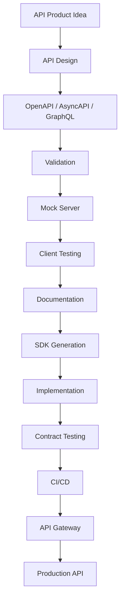
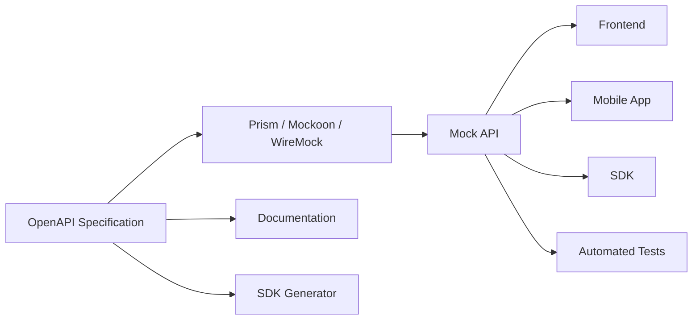
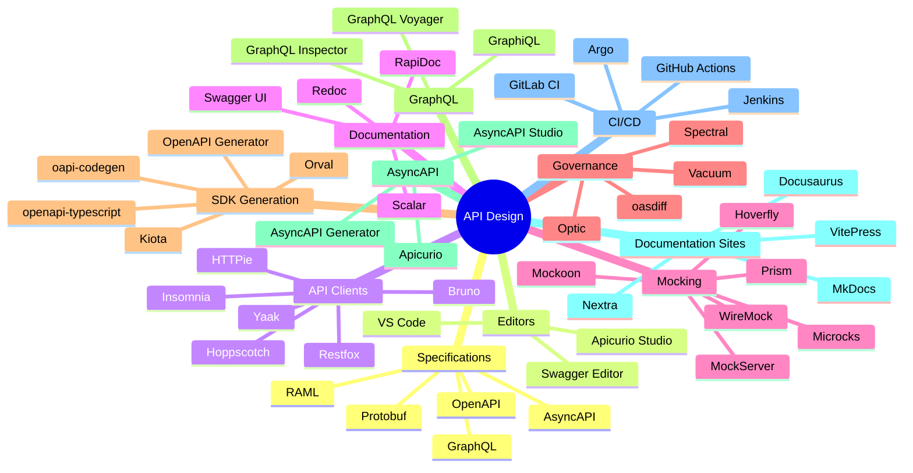

# Awesome-API-Design-Platform

## 🎨 Top API Design Platforms & Open-Source API Design Software

> A curated list of **API design platforms, OpenAPI editors, API specification tools, API documentation platforms, API mocking tools, API clients and open-source software** for designing modern APIs.

API design platforms enable teams to move from an API idea to a formal, testable and documented API contract.

Modern API design typically revolves around:

* OpenAPI
* AsyncAPI
* GraphQL
* Protocol Buffers
* RAML
* gRPC
* API schemas
* API contracts
* Mock servers
* API documentation
* Code generation
* SDK generation
* Governance
* Style guides
* Versioning
* Contract testing
* Git-based workflows

The ecosystem ranges from all-in-one platforms such as **Postman** to design-first platforms such as **Stoplight** and **SwaggerHub**, developer documentation platforms such as **ReadMe**, API clients such as **Insomnia**, and specialized SDK/API development platforms such as **Speakeasy**.

This repository focuses primarily on **open-source and self-hostable alternatives**, while keeping commercial API design platforms in a separate section.

---

## 📑 Table of Contents

* [☁️ SaaS/Hosted Platforms](#️-saashosted-platforms)
* [🌍 Open-Source](#-open-source)
* [📝 Open-Source OpenAPI Editors](#-open-source-openapi-editors)
* [🧪 Open-Source API Clients & Design Tools](#-open-source-api-clients--design-tools)
* [📚 Open-Source API Documentation](#-open-source-api-documentation)
* [🎭 Open-Source API Mocking](#-open-source-api-mocking)
* [⚙️ Open-Source API Specification Tools](#️-open-source-api-specification-tools)
* [🔌 Open-Source GraphQL Design Tools](#-open-source-graphql-design-tools)
* [📡 Open-Source AsyncAPI Tools](#-open-source-asyncapi-tools)
* [🚀 Open-Source SDK & Code Generation](#-open-source-sdk--code-generation)
* [🔍 Open-Source API Validation & Linting](#-open-source-api-validation--linting)
* [🧩 Commercial Platform → Open-Source Equivalent](#-commercial-platform--open-source-equivalent)
* [🏗️ API Design Architecture](#️-api-design-architecture)
* [🔄 Open-Source API Design Workflow](#-open-source-api-design-workflow)
* [📖 API-First Development Architecture](#-api-first-development-architecture)
* [🎭 API Mocking Architecture](#-api-mocking-architecture)
* [⚖️ Commercial vs Open-Source](#️-commercial-vs-open-source)
* [🚀 Recommended Open-Source Stacks](#-recommended-open-source-stacks)
* [📊 API Design Technology Comparison](#-api-design-technology-comparison)
* [🎯 Recommended Projects by Use Case](#-recommended-projects-by-use-case)
* [🏢 Building a Stoplight Alternative](#-building-a-stoplight-alternative)
* [🧑‍💻 Building a Postman Alternative](#-building-a-postman-alternative)
* [📚 Building an Open-Source API Portal](#-building-an-open-source-api-portal)
* [🌐 Open-Source API Design Landscape](#-open-source-api-design-landscape)
* [🧠 Why Open-Source API Design Matters](#-why-open-source-api-design-matters)
* [🤝 Contributing](#-contributing)
* [⚠️ Disclaimer](#️-disclaimer)

---

# ☁️ SaaS/Hosted Platforms

| Platform                                                        | Company                      | Primary Focus                  | Key Capabilities                                                            |
| --------------------------------------------------------------- | ---------------------------- | ------------------------------ | --------------------------------------------------------------------------- |
| [Postman](https://www.postman.com/)                             | Postman                      | API development platform       | API design, collections, testing, mocking, documentation and collaboration  |
| [Stoplight](https://stoplight.io/)                              | Stoplight                    | API design-first development   | OpenAPI design, governance, documentation, mocking and style guides         |
| [SwaggerHub](https://swagger.io/tools/swaggerhub/)              | SmartBear                    | API design & governance        | OpenAPI design, collaboration, versioning, governance and documentation     |
| [ReadMe](https://readme.com/)                                   | ReadMe                       | Developer portals              | API documentation, guides, API explorer, analytics and developer experience |
| [Apicurio](https://www.apicur.io/)                              | Apicurio / Red Hat ecosystem | Open API design & registry     | OpenAPI, AsyncAPI, visual editing, registry and governance                  |
| [Insomnia](https://insomnia.rest/)                              | Kong                         | API client & design            | OpenAPI design, REST, GraphQL, gRPC, testing and debugging                  |
| [Kong Insomnia](https://insomnia.rest/)                         | Kong                         | API development                | API design, debugging, testing, documentation and Git workflows             |
| [Apiary](https://apiary.io/)                                    | Oracle                       | API design & documentation     | API Blueprint, mocking, documentation and collaboration                     |
| [RapidAPI Studio](https://rapidapi.com/)                        | RapidAPI                     | API development platform       | API design, testing, documentation, publishing and API marketplace          |
| [Speakeasy](https://www.speakeasy.com/)                         | Speakeasy                    | SDK/API development            | OpenAPI tooling, SDK generation, API design and developer experience        |
| [Redocly](https://redocly.com/)                                 | Redocly                      | API documentation & governance | OpenAPI, docs, linting, API registry and developer portals                  |
| [Bump.sh](https://bump.sh/)                                     | Bump.sh                      | API documentation              | OpenAPI docs, changelogs and API contract workflows                         |
| [Fern](https://buildwithfern.com/)                              | Fern                         | API development                | API definitions, SDK generation and documentation                           |
| [Mintlify](https://mintlify.com/)                               | Mintlify                     | Developer documentation        | API documentation, reference docs and developer portals                     |
| [Scalar](https://scalar.com/)                                   | Scalar                       | API references & tooling       | OpenAPI docs, API client and developer experience                           |
| [Apidog](https://apidog.com/)                                   | Apidog                       | All-in-one API development     | API design, testing, mocking, documentation and collaboration               |
| [Stoplight Elements](https://stoplight.io/open-source/elements) | Stoplight                    | API documentation              | OpenAPI reference rendering                                                 |
| [Swagger UI](https://swagger.io/tools/swagger-ui/)              | SmartBear                    | API documentation              | Interactive OpenAPI documentation                                           |
| [Swagger Editor](https://editor.swagger.io/)                    | SmartBear                    | API design                     | Browser-based OpenAPI editing and validation                                |

Postman currently supports API specifications including OpenAPI, AsyncAPI, protobuf, GraphQL and Smithy, and can generate collections from specifications.

---

# 🌍 Open-Source

The open-source API design ecosystem is considerably broader than a single "Postman alternative."

It can be assembled from several layers:

```text
                         API DESIGN
                             │
       ┌─────────────────────┼─────────────────────┐
       │                     │                     │
       ▼                     ▼                     ▼
   Specification          Editing              Testing
       │                     │                     │
       ▼                     ▼                     ▼
    OpenAPI             Swagger Editor          Bruno
    AsyncAPI             Apicurio              Insomnia
    GraphQL              Stoplight             Hoppscotch
    Protobuf             VS Code               Hurl
       │
       └─────────────────────┬─────────────────────┘
                             ▼
                         Mocking
                             │
                             ▼
                           Prism
                             │
                             ▼
                       Documentation
                             │
                  ┌──────────┼──────────┐
                  ▼          ▼          ▼
                Redoc      Scalar     Swagger UI
                             │
                             ▼
                       SDK Generation
                             │
                  ┌──────────┼──────────┐
                  ▼          ▼          ▼
             OpenAPI Gen   Fern       Speakeasy
```

---

# 📝 Open-Source OpenAPI Editors

OpenAPI is the dominant specification format for design-first REST APIs. Stoplight describes OpenAPI as a human- and machine-readable standard used for design-driven API development.

| Project                                                                | Description                                  | License / Model |
| ---------------------------------------------------------------------- | -------------------------------------------- | --------------- |
| [Swagger Editor](https://github.com/swagger-api/swagger-editor)        | Browser-based OpenAPI editor                 | Apache-2.0      |
| [Apicurio Studio](https://github.com/Apicurio/apicurio-studio)         | Visual OpenAPI / AsyncAPI design             | Apache-2.0      |
| [Swagger UI](https://github.com/swagger-api/swagger-ui)                | Interactive OpenAPI documentation            | Apache-2.0      |
| [OpenAPI Generator](https://github.com/OpenAPITools/openapi-generator) | SDK/server generation                        | Apache-2.0      |
| [Redoc](https://github.com/Redocly/redoc)                              | OpenAPI documentation renderer               | MIT             |
| [Scalar](https://github.com/scalar/scalar)                             | Modern OpenAPI reference and tooling         | MIT             |
| [OpenAPI Spec](https://github.com/OAI/OpenAPI-Specification)           | OpenAPI specification itself                 | Apache-2.0      |
| [Stoplight Prism](https://github.com/stoplightio/prism)                | OpenAPI mock server / validation             | Apache-2.0      |
| [Optic](https://github.com/opticdev/optic)                             | API contract governance and change detection | Apache-2.0      |
| [Vacuum](https://github.com/daveshanley/vacuum)                        | Fast OpenAPI linter                          | MIT             |

---

# 🎨 Apicurio

[Apicurio Studio](https://github.com/Apicurio/apicurio-studio) is one of the strongest open-source projects for visual API design.

It supports API design workflows around:

* OpenAPI
* AsyncAPI
* Visual editing
* Schema design
* API validation
* Reusable components
* API governance
* Registry integration

```text
                    Apicurio Studio
                          │
             ┌────────────┼────────────┐
             ▼            ▼            ▼
          OpenAPI       AsyncAPI     Schemas
             │            │            │
             └────────────┼────────────┘
                          ▼
                    API Registry
                          │
                          ▼
                    API Consumers
```

---

# 🧪 Open-Source API Clients & Design Tools

These tools overlap with API design because they allow developers to create API definitions, requests, examples, tests and environments.

| Project                                                | Primary Focus                 |
| ------------------------------------------------------ | ----------------------------- |
| [Insomnia](https://github.com/Kong/insomnia)           | API client + design           |
| [Bruno](https://github.com/usebruno/bruno)             | Git-native API client         |
| [Hoppscotch](https://github.com/hoppscotch/hoppscotch) | Web API development ecosystem |
| [Yaak](https://github.com/mountain-loop/yaak)          | Local-first API client        |
| [HTTPie](https://github.com/httpie/cli)                | API client / CLI              |
| [Hurl](https://github.com/Orange-OpenSource/hurl)      | HTTP testing                  |
| [Posting](https://github.com/darrenburns/posting)      | Terminal API client           |
| [Restfox](https://github.com/flawiddsouza/Restfox)     | API client                    |
| [API Dash](https://github.com/foss42/apidash)          | Cross-platform API client     |
| [Thunder Client](https://www.thunderclient.com/)       | VS Code API client            |
| [curl](https://github.com/curl/curl)                   | HTTP client / CLI             |

Insomnia's current documentation describes it as an open-source desktop client for designing, testing and documenting APIs, with local and Git-driven workflows.

---

# 📁 Git-Native API Design

A major open-source trend is moving API definitions and request collections into Git-compatible files.

```text
                  Git Repository
                       │
            ┌──────────┼──────────┐
            ▼          ▼          ▼
          OpenAPI    Requests    Tests
            │          │          │
            └──────────┼──────────┘
                       ▼
                     CI/CD
                       │
          ┌────────────┼────────────┐
          ▼            ▼            ▼
        Linting      Testing     Docs
          │            │            │
          └────────────┼────────────┘
                       ▼
                  API Gateway
```

Projects particularly suited to local/Git-centric workflows include:

* Bruno
* Insomnia
* Yaak
* Hurl
* OpenAPI Generator
* Spectral
* Optic

Bruno uses a file-based, Git-oriented workflow, while Insomnia supports local and Git-driven storage.

---

# 📚 Open-Source API Documentation

| Project                                                                | Description                       |
| ---------------------------------------------------------------------- | --------------------------------- |
| [Redoc](https://github.com/Redocly/redoc)                              | OpenAPI documentation renderer    |
| [Scalar](https://github.com/scalar/scalar)                             | Modern interactive API reference  |
| [Swagger UI](https://github.com/swagger-api/swagger-ui)                | Interactive OpenAPI documentation |
| [RapiDoc](https://github.com/rapi-doc/RapiDoc)                         | Web-component API documentation   |
| [Stoplight Elements](https://github.com/stoplightio/elements)          | API reference components          |
| [Docusaurus](https://github.com/facebook/docusaurus)                   | Documentation platform            |
| [MkDocs](https://github.com/mkdocs/mkdocs)                             | Markdown documentation            |
| [VitePress](https://github.com/vuejs/vitepress)                        | Static documentation              |
| [Nextra](https://github.com/shuding/nextra)                            | Next.js documentation framework   |
| [GitBook Open Source Components](https://github.com/GitbookIO/gitbook) | Documentation ecosystem           |

A modern self-hosted API portal can therefore be assembled without using a proprietary documentation platform.

```text
OpenAPI
   │
   ▼
Scalar / Redoc / Swagger UI
   │
   ▼
Docusaurus / VitePress / MkDocs
   │
   ▼
Custom Developer Portal
```

---

# 🎭 Open-Source API Mocking

Mocking allows frontend teams and API consumers to work before backend implementation is complete.

## Stoplight Prism

[Prism](https://github.com/stoplightio/prism) is an open-source HTTP mock and validation server built around OpenAPI.

```text
OpenAPI Specification
         │
         ▼
       Prism
         │
         ▼
   Mock HTTP Server
         │
         ▼
Frontend / Mobile / SDK
```

Useful capabilities include:

* Dynamic mocking
* Static examples
* Request validation
* Response validation
* OpenAPI-based simulation
* Contract testing workflows

---

## Other Open-Source Mocking Tools

| Project                                                 | Focus                             |
| ------------------------------------------------------- | --------------------------------- |
| [Prism](https://github.com/stoplightio/prism)           | OpenAPI mock server               |
| [Mockoon](https://github.com/mockoon/mockoon)           | API mocking                       |
| [WireMock](https://github.com/wiremock/wiremock)        | HTTP API mocking                  |
| [Hoverfly](https://github.com/SpectoLabs/hoverfly)      | Service virtualization            |
| [MockServer](https://github.com/mock-server/mockserver) | HTTP/HTTPS mocking                |
| [Mountebank](https://github.com/bbyars/mountebank)      | Service virtualization            |
| [Microcks](https://github.com/microcks/microcks)        | API mocking and contract testing  |
| [WireMock](https://github.com/wiremock/wiremock)        | Mock APIs and integration testing |

---

# ⚙️ Open-Source API Specification Tools

## OpenAPI

```text
OpenAPI
  │
  ├── Design
  ├── Validation
  ├── Documentation
  ├── Mocking
  ├── Testing
  ├── Code Generation
  ├── SDK Generation
  └── Governance
```

Core projects:

| Project                                                                | Purpose                    |
| ---------------------------------------------------------------------- | -------------------------- |
| [OpenAPI Specification](https://github.com/OAI/OpenAPI-Specification)  | API specification standard |
| [Swagger Editor](https://github.com/swagger-api/swagger-editor)        | API editing                |
| [Swagger UI](https://github.com/swagger-api/swagger-ui)                | API documentation          |
| [OpenAPI Generator](https://github.com/OpenAPITools/openapi-generator) | Code generation            |
| [Redoc](https://github.com/Redocly/redoc)                              | Documentation              |
| [Prism](https://github.com/stoplightio/prism)                          | Mocking                    |
| [Spectral](https://github.com/stoplightio/spectral)                    | API linting                |
| [Optic](https://github.com/opticdev/optic)                             | API change detection       |
| [Vacuum](https://github.com/daveshanley/vacuum)                        | OpenAPI linting            |
| [oasdiff](https://github.com/tufin/oasdiff)                            | OpenAPI diffing            |

---

# 🔌 Open-Source GraphQL Design Tools

API design is no longer limited to REST/OpenAPI.

| Project                                                                | Description                       |
| ---------------------------------------------------------------------- | --------------------------------- |
| [GraphQL](https://github.com/graphql/graphql-js)                       | GraphQL reference implementation  |
| [GraphiQL](https://github.com/graphql/graphiql)                        | GraphQL IDE                       |
| [GraphQL Voyager](https://github.com/graphql-kit/graphql-voyager)      | GraphQL schema visualization      |
| [GraphQL Inspector](https://github.com/graphql-hive/graphql-inspector) | Schema validation / diffing       |
| [Apollo Router](https://github.com/apollographql/router)               | GraphQL federation infrastructure |
| [Hasura](https://github.com/hasura/graphql-engine)                     | GraphQL API platform              |

A GraphQL design workflow can look like:

```text
GraphQL Schema
      │
      ▼
  GraphiQL
      │
      ▼
Schema Validation
      │
      ▼
GraphQL Inspector
      │
      ▼
CI/CD
```

---

# 📡 Open-Source AsyncAPI Tools

AsyncAPI provides a specification-driven approach for event-driven APIs.

```text
                         AsyncAPI
                            │
           ┌────────────────┼────────────────┐
           ▼                ▼                ▼
        Kafka             MQTT             AMQP
           │                │                │
           └────────────────┼────────────────┘
                            ▼
                      Event Consumers
```

| Project                                                     | Description                    |
| ----------------------------------------------------------- | ------------------------------ |
| [AsyncAPI Specification](https://github.com/asyncapi/spec)  | Event-driven API specification |
| [AsyncAPI Studio](https://studio.asyncapi.com/)             | AsyncAPI design                |
| [AsyncAPI CLI](https://github.com/asyncapi/cli)             | AsyncAPI tooling               |
| [AsyncAPI Generator](https://github.com/asyncapi/generator) | Code generation                |
| [Apicurio](https://github.com/Apicurio/apicurio-studio)     | Visual API design              |

---

# 🚀 Open-Source SDK & Code Generation

API design becomes significantly more valuable when the specification can generate client libraries and server scaffolding.

```text
                     API Specification
                            │
             ┌──────────────┼──────────────┐
             ▼              ▼              ▼
         TypeScript        Python          Go
             │              │              │
             ▼              ▼              ▼
           SDK            SDK            SDK
             │              │              │
             └──────────────┼──────────────┘
                            ▼
                       API Consumers
```

| Project                                                                | Purpose                       |
| ---------------------------------------------------------------------- | ----------------------------- |
| [OpenAPI Generator](https://github.com/OpenAPITools/openapi-generator) | Client/server code generation |
| [Swagger Codegen](https://github.com/swagger-api/swagger-codegen)      | Code generation               |
| [Kiota](https://github.com/microsoft/kiota)                            | API client generation         |
| [Fern](https://github.com/fern-api/fern)                               | API SDK generation            |
| [Speakeasy](https://www.speakeasy.com/)                                | Commercial SDK generation     |
| [oapi-codegen](https://github.com/oapi-codegen/oapi-codegen)           | Go code generation            |
| [openapi-typescript](https://github.com/openapi-ts/openapi-typescript) | TypeScript types              |
| [Orval](https://github.com/orval-labs/orval)                           | TypeScript client generation  |
| [openapi-generator](https://github.com/OpenAPITools/openapi-generator) | Multi-language generation     |

---

# 🔍 Open-Source API Validation & Linting

API design governance requires automated validation.

```text
                 OpenAPI File
                      │
                      ▼
                   Linter
                      │
        ┌─────────────┼─────────────┐
        ▼             ▼             ▼
     Syntax       Style Rules    Breaking Changes
        │             │             │
        └─────────────┼─────────────┘
                      ▼
                     CI
```

| Project                                                                                | Primary Focus                    |
| -------------------------------------------------------------------------------------- | -------------------------------- |
| [Spectral](https://github.com/stoplightio/spectral)                                    | API linting                      |
| [Vacuum](https://github.com/daveshanley/vacuum)                                        | High-performance OpenAPI linting |
| [oasdiff](https://github.com/Tufin/oasdiff)                                            | OpenAPI diff / breaking changes  |
| [Optic](https://github.com/opticdev/optic)                                             | API contract governance          |
| [OpenAPI Enforcer](https://github.com/byu-oit/openapi-enforcer-js)                     | OpenAPI validation               |
| [Prance](https://github.com/RonnyPfannschmidt/prance)                                  | OpenAPI parsing / validation     |
| [openapi-schema-validator](https://github.com/asteasolutions/openapi-schema-validator) | Schema validation                |
| [Redocly CLI](https://github.com/Redocly/redocly-cli)                                  | OpenAPI linting / bundling       |

---

# 🧩 Commercial Platform → Open-Source Equivalent

| Commercial Platform | Open-Source Equivalent / Building Blocks                       |
| ------------------- | -------------------------------------------------------------- |
| **Postman**         | Bruno + Hoppscotch + OpenAPI + Prism + Spectral                |
| **Stoplight**       | Apicurio + Prism + Spectral + Redoc/Scalar                     |
| **SwaggerHub**      | Swagger Editor + Swagger UI + Spectral + OpenAPI Registry      |
| **ReadMe**          | Docusaurus/VitePress + Scalar/Redoc + custom API explorer      |
| **Apicurio Studio** | Apicurio Studio itself + Apicurio Registry                     |
| **Insomnia**        | Insomnia + OpenAPI + Spectral                                  |
| **Kong Insomnia**   | Insomnia + OpenAPI + Prism + Spectral                          |
| **Apiary**          | OpenAPI + Prism + Redoc/Swagger UI                             |
| **RapidAPI Studio** | OpenAPI + Swagger UI/Scalar + API gateway + custom portal      |
| **Speakeasy**       | OpenAPI Generator + openapi-typescript + oapi-codegen          |
| **Redocly**         | Redoc + Redocly CLI + Docusaurus/VitePress                     |
| **Bump.sh**         | OpenAPI + Redoc + GitHub Actions + changelog tooling           |
| **Fern**            | OpenAPI Generator + custom templates + documentation framework |
| **Scalar**          | Scalar itself + OpenAPI                                        |
| **Swagger Editor**  | Swagger Editor itself                                          |
| **Swagger UI**      | Swagger UI itself                                              |

---

# 🏗️ API Design Architecture

A modern API design platform can be represented as:



---

# 🔄 Open-Source API Design Workflow

```text
                         API IDEA
                            │
                            ▼
                     API Specification
                            │
                            ▼
                 ┌────────────────────┐
                 │ OpenAPI / AsyncAPI  │
                 └─────────┬──────────┘
                           │
                           ▼
                       Linting
                           │
                           ▼
                      Mock Server
                           │
                           ▼
                     Client Testing
                           │
                           ▼
                     Documentation
                           │
                           ▼
                    SDK Generation
                           │
                           ▼
                     Implementation
                           │
                           ▼
                  Contract Validation
                           │
                           ▼
                         CI/CD
                           │
                           ▼
                       Production
```

---

# 📖 API-First Development Architecture

API-first development means the API contract is designed before implementation.

```text
Traditional Development

Code
 │
 ▼
API
 │
 ▼
Documentation


API-First Development

Business Requirements
          │
          ▼
      API Contract
          │
    ┌─────┼─────┐
    ▼     ▼     ▼
  Mock   Docs   SDK
    │     │     │
    └─────┼─────┘
          ▼
      Implementation
          │
          ▼
        Tests
          │
          ▼
      Production
```

Postman's current API-first tooling follows a similar model: API definitions can be developed alongside collections, documentation and tests, with validation and code generation available within the workflow.

---

# 🎭 API Mocking Architecture



This allows frontend and consumer development to begin before the production backend is finished.

---

# 🧪 Contract Testing Architecture

```text
                    API Specification
                           │
                           ▼
                     Contract Rules
                           │
              ┌────────────┼────────────┐
              ▼            ▼            ▼
          Provider       Consumer      Schema
            Tests          Tests       Tests
              │            │            │
              └────────────┼────────────┘
                           ▼
                           CI
                           │
                    ┌──────┴──────┐
                    ▼             ▼
                  Pass           Fail
                    │             │
                    ▼             ▼
                 Deploy       Fix API
```

Useful projects include:

* Prism
* Microcks
* Pact
* Spectral
* oasdiff
* Optic

---

# 🧑‍💻 API Design GitOps Workflow

```text
Developer
    │
    ▼
Edit OpenAPI
    │
    ▼
Git Commit
    │
    ▼
Pull Request
    │
    ├── Spectral
    ├── Vacuum
    ├── oasdiff
    └── Contract Tests
    │
    ▼
CI
    │
    ▼
Mock API
    │
    ▼
Documentation Build
    │
    ▼
SDK Generation
    │
    ▼
API Deployment
```

This approach makes the API specification a **version-controlled source artifact** rather than a document trapped inside a proprietary API platform.

---

# ⚖️ Commercial vs Open-Source

| Capability             | Commercial API Design Platform | Open-Source Stack |
| ---------------------- | ------------------------------ | ----------------- |
| OpenAPI Editing        | ✅                              | ✅                 |
| Visual Editor          | ✅                              | ✅                 |
| API Testing            | ✅                              | ✅                 |
| Mocking                | ✅                              | ✅                 |
| Documentation          | ✅                              | ✅                 |
| SDK Generation         | ✅                              | ✅                 |
| Git Integration        | ✅                              | ✅                 |
| API Governance         | ✅                              | ✅                 |
| Style Guides           | ✅                              | ✅                 |
| Version Control        | ✅                              | ✅                 |
| Collaboration          | ✅                              | ✅                 |
| Developer Portal       | ✅                              | ✅                 |
| Hosting                | Managed                        | Self-managed      |
| Data Ownership         | Vendor-dependent               | Full              |
| Customization          | Medium                         | Very High         |
| Vendor Lock-in         | Higher                         | Lower             |
| Air-Gapped Deployment  | Limited                        | ✅                 |
| Source Code            | Usually proprietary            | ✅                 |
| Infrastructure         | Managed                        | Self-managed      |
| Time to Deploy         | Fast                           | Medium            |
| Operational Complexity | Lower                          | Higher            |
| Custom Workflows       | Limited                        | Very High         |

---

# 🚀 Recommended Open-Source Stacks

## 🏆 1. Best General-Purpose API Design Stack

```text
Swagger Editor
      +
OpenAPI
      +
Spectral
      +
Prism
      +
Scalar
      +
OpenAPI Generator
```

This gives you:

```text
Design
+
Lint
+
Mock
+
Document
+
Generate SDKs
```

---

# 🎨 2. Stoplight-Like Stack

```text
Apicurio Studio
       +
Apicurio Registry
       +
Spectral
       +
Prism
       +
Redoc / Scalar
```

Best for:

* API-first development
* Visual design
* Governance
* Enterprise API catalogs
* Self-hosted environments

---

# 🧪 3. Postman-Like Open-Source Stack

```text
Bruno
 +
OpenAPI
 +
Prism
 +
Spectral
 +
Hurl
```

Best for:

* Local development
* Git-native workflows
* API testing
* CI/CD
* Developer-owned API collections

---

# 📚 4. ReadMe-Like Open-Source Stack

```text
OpenAPI
   +
Scalar / Redoc
   +
Docusaurus
   +
Search
   +
Custom API Explorer
   +
GitHub Actions
```

Architecture:

```text
OpenAPI
   │
   ├── Scalar
   ├── Redoc
   └── SDK examples
          │
          ▼
      Docusaurus
          │
          ▼
   Developer Portal
```

---

# 🚀 5. SDK-First API Platform

```text
OpenAPI
   │
   ▼
OpenAPI Generator
   │
   ├── TypeScript SDK
   ├── Python SDK
   ├── Go SDK
   ├── Java SDK
   └── Kotlin SDK
```

Add:

```text
openapi-typescript
oapi-codegen
Orval
Kiota
```

for language-specific workflows.

---

# 🏢 6. Enterprise API Governance Stack

```text
                 Git Repository
                       │
                       ▼
                   OpenAPI
                       │
          ┌────────────┼────────────┐
          ▼            ▼            ▼
       Spectral      Vacuum       oasdiff
          │            │            │
          └────────────┼────────────┘
                       ▼
                       CI
                       │
                       ▼
                 Approval Gate
                       │
                       ▼
                 API Registry
                       │
                       ▼
              Developer Portal
```

Recommended:

```text
Apicurio Registry
+
Spectral
+
Vacuum
+
oasdiff
+
Redoc / Scalar
```

---

# 📊 API Design Technology Comparison

| Project           | Design | Testing | Mocking | Docs | Git | SDK Generation | Self-Host |
| ----------------- | :----: | :-----: | :-----: | :--: | :-: | :------------: | :-------: |
| Postman           |    ✅   |    ✅    |    ✅    |   ✅  |  ✅  |        ✅       |     ⚠️    |
| Stoplight         |    ✅   |    ✅    |    ✅    |   ✅  |  ✅  |       ⚠️       |     ⚠️    |
| SwaggerHub        |    ✅   |    ⚠️   |    ⚠️   |   ✅  |  ✅  |        ✅       |     ⚠️    |
| ReadMe            |   ⚠️   |    ⚠️   |    ❌    |   ✅  |  ✅  |       ⚠️       |     ❌     |
| Apicurio          |    ✅   |    ⚠️   |    ⚠️   |   ✅  |  ✅  |       ⚠️       |     ✅     |
| Insomnia          |    ✅   |    ✅    |    ✅    |   ✅  |  ✅  |       ⚠️       |     ✅     |
| Apiary            |    ✅   |    ⚠️   |    ✅    |   ✅  |  ⚠️ |       ⚠️       |     ❌     |
| RapidAPI Studio   |    ✅   |    ✅    |    ⚠️   |   ✅  |  ⚠️ |        ✅       |     ❌     |
| Speakeasy         |    ✅   |    ⚠️   |    ⚠️   |   ✅  |  ✅  |        ✅       |     ⚠️    |
| Swagger Editor    |    ✅   |    ❌    |    ❌    |  ⚠️  |  ✅  |       ⚠️       |     ✅     |
| Bruno             |   ⚠️   |    ✅    |    ⚠️   |  ⚠️  |  ✅  |       ⚠️       |     ✅     |
| Hoppscotch        |   ⚠️   |    ✅    |    ⚠️   |  ⚠️  |  ✅  |       ⚠️       |     ✅     |
| Scalar            |   ⚠️   |    ✅    |    ⚠️   |   ✅  |  ✅  |       ⚠️       |     ✅     |
| Prism             |    ❌   |    ✅    |    ✅    |   ❌  |  ✅  |        ❌       |     ✅     |
| Spectral          |    ❌   |    ❌    |    ❌    |   ❌  |  ✅  |        ❌       |     ✅     |
| OpenAPI Generator |    ❌   |    ❌    |    ❌    |   ❌  |  ✅  |        ✅       |     ✅     |
| Redoc             |    ❌   |    ❌    |    ❌    |   ✅  |  ✅  |        ❌       |     ✅     |
| Optic             |   ⚠️   |    ⚠️   |    ❌    |   ❌  |  ✅  |        ❌       |     ✅     |

---

# 🎯 Recommended Projects by Use Case

| Use Case                    | Recommended Starting Point               |
| --------------------------- | ---------------------------------------- |
| Best open-source API editor | **Swagger Editor**                       |
| Visual API design           | **Apicurio Studio**                      |
| Postman replacement         | **Bruno / Hoppscotch / Insomnia**        |
| Git-native API development  | **Bruno**                                |
| Privacy-focused API client  | **Yaak**                                 |
| API mocking                 | **Prism**                                |
| Advanced HTTP mocking       | **WireMock**                             |
| API documentation           | **Scalar / Redoc**                       |
| Interactive API docs        | **Swagger UI / Scalar**                  |
| API linting                 | **Spectral / Vacuum**                    |
| Breaking-change detection   | **oasdiff / Optic**                      |
| SDK generation              | **OpenAPI Generator**                    |
| TypeScript SDKs             | **openapi-typescript / Orval**           |
| Go SDK/server generation    | **oapi-codegen**                         |
| AsyncAPI design             | **AsyncAPI Studio / Apicurio**           |
| GraphQL design              | **GraphiQL / GraphQL Inspector**         |
| API contract testing        | **Prism / Microcks / Pact**              |
| Enterprise governance       | **Apicurio + Spectral + oasdiff**        |
| API documentation portal    | **Docusaurus + Scalar**                  |
| Fully self-hosted stack     | **Apicurio + Prism + Scalar + Spectral** |

---

# 🏢 Building a Stoplight Alternative

Stoplight-like functionality can be decomposed into:

```text
                         STOPLIGHT-LIKE STACK
                                  │
             ┌────────────────────┼────────────────────┐
             │                    │                    │
             ▼                    ▼                    ▼
        API Designer          API Governance       Documentation
             │                    │                    │
       Apicurio Studio          Spectral          Scalar / Redoc
             │                    │                    │
             └────────────────────┼────────────────────┘
                                  ▼
                             API Registry
                                  │
                                  ▼
                              Prism Mock
                                  │
                                  ▼
                            CI/CD Pipeline
```

Suggested implementation:

```text
Visual Design       → Apicurio Studio
API Registry        → Apicurio Registry
Linting             → Spectral
Mocking             → Prism
Documentation       → Scalar / Redoc
Diffing             → oasdiff
CI/CD               → GitHub Actions
SDK Generation      → OpenAPI Generator
```

---

# 🧑‍💻 Building a Postman Alternative

A lightweight open-source Postman-style ecosystem can be assembled from:

```text
                         API WORKSPACE
                              │
             ┌────────────────┼────────────────┐
             ▼                ▼                ▼
           Bruno          Hoppscotch       Insomnia
             │                │                │
             └────────────────┼────────────────┘
                              ▼
                         OpenAPI Spec
                              │
                ┌─────────────┼─────────────┐
                ▼             ▼             ▼
             Spectral       Prism         Hurl
                │             │             │
                └─────────────┼─────────────┘
                              ▼
                             CI
```

For a Git-native workflow:

```text
Bruno
+
OpenAPI
+
Spectral
+
Prism
+
Hurl
+
GitHub Actions
```

---

# 📚 Building an Open-Source API Portal

A complete self-hosted developer portal can be built around an OpenAPI source of truth.

```text
                    OpenAPI Repository
                           │
                           ▼
                       Validation
                           │
              ┌────────────┼────────────┐
              ▼            ▼            ▼
          Spectral       oasdiff       Tests
              │            │            │
              └────────────┼────────────┘
                           ▼
                         Build
                           │
                           ▼
                  Scalar / Redoc
                           │
                           ▼
                     Docusaurus
                           │
                           ▼
                 Developer Portal
                           │
              ┌────────────┼────────────┐
              ▼            ▼            ▼
           Guides      API Reference   SDKs
```

---

# 🧱 API Design Layers

```text
┌───────────────────────────────────────────────┐
│             DEVELOPER PORTAL                 │
│        Docusaurus / VitePress / Docs         │
└───────────────────────┬───────────────────────┘
                        │
┌───────────────────────▼───────────────────────┐
│             API DOCUMENTATION                │
│       Scalar / Redoc / Swagger UI            │
└───────────────────────┬───────────────────────┘
                        │
┌───────────────────────▼───────────────────────┐
│               API CONTRACT                   │
│           OpenAPI / AsyncAPI                 │
└───────────────────────┬───────────────────────┘
                        │
┌───────────────────────▼───────────────────────┐
│               API GOVERNANCE                 │
│ Spectral / Vacuum / oasdiff / Optic          │
└───────────────────────┬───────────────────────┘
                        │
┌───────────────────────▼───────────────────────┐
│                API MOCKING                   │
│ Prism / WireMock / Mockoon / Microcks        │
└───────────────────────┬───────────────────────┘
                        │
┌───────────────────────▼───────────────────────┐
│             SDK GENERATION                   │
│ OpenAPI Generator / Kiota / oapi-codegen     │
└───────────────────────┬───────────────────────┘
                        │
┌───────────────────────▼───────────────────────┐
│              IMPLEMENTATION                  │
│     Backend / Gateway / Microservices        │
└───────────────────────────────────────────────┘
```

---

# 🌐 Open-Source API Design Landscape



---

# 🔥 API Design Platform vs API Client

These categories overlap, but they are not identical.

```text
API CLIENT

Send Request
     │
     ▼
Inspect Response
     │
     ▼
Write Test
     │
     ▼
Debug API


API DESIGN PLATFORM

Business Requirement
     │
     ▼
API Contract
     │
     ▼
Schema
     │
     ▼
Mock
     │
     ▼
Documentation
     │
     ▼
SDK
     │
     ▼
Implementation
     │
     ▼
Governance
```

This distinction is important when choosing an open-source alternative.

A tool such as **Bruno** is primarily a Git-native API client, while **Apicurio Studio** is much closer to a visual API design platform. **Scalar** is primarily documentation/reference tooling rather than a complete API design suite. **Prism** specializes in mocking and validation.

---

# 🧠 Why Open-Source API Design Matters

Commercial API platforms are extremely convenient, but API specifications are increasingly becoming critical engineering assets.

Keeping the API contract in open formats such as OpenAPI provides:

* Git version control
* Portability
* Vendor independence
* Automated validation
* CI/CD integration
* Code generation
* Documentation generation
* Mocking
* Contract testing
* SDK generation
* Long-term archival
* Local development
* Air-gapped deployment

The ideal architecture is therefore often:

```text
                     YOUR API CONTRACT
                            │
                            ▼
                          OpenAPI
                            │
       ┌────────────────────┼────────────────────┐
       ▼                    ▼                    ▼
      Docs                Mocking              SDKs
       │                    │                    │
    Scalar               Prism             Generator
       │                    │                    │
       └────────────────────┼────────────────────┘
                            ▼
                          Tests
                            │
                            ▼
                           CI/CD
                            │
                            ▼
                         Production
```

Instead of making a proprietary API platform the source of truth, the **API specification itself becomes the source of truth**.

---

# ⭐ Recommended Open-Source Reference Architecture

For a serious self-hosted API design platform:

```text
                         GIT REPOSITORY
                              │
                              ▼
                         OpenAPI / AsyncAPI
                              │
                ┌─────────────┼─────────────┐
                ▼             ▼             ▼
             Apicurio      Spectral       oasdiff
                │             │             │
                └─────────────┼─────────────┘
                              ▼
                             CI
                              │
                 ┌────────────┼────────────┐
                 ▼            ▼            ▼
               Prism        Scalar       Generator
                 │            │            │
                 ▼            ▼            ▼
               Mock       API Portal      SDKs
                 │            │            │
                 └────────────┼────────────┘
                              ▼
                       Backend Services
                              │
                              ▼
                         API Gateway
```

---

# 🛠️ Minimal Self-Hosted Implementation

A surprisingly capable API design platform can be assembled with:

```text
Apicurio Studio
+
OpenAPI
+
Spectral
+
Prism
+
Scalar
+
OpenAPI Generator
+
GitHub Actions
```

This provides:

```text
Design
   ↓
Validate
   ↓
Mock
   ↓
Document
   ↓
Generate SDK
   ↓
Test
   ↓
Deploy
```

without requiring a proprietary API design platform to be the system of record.

---

# 🤝 Contributing

Contributions are welcome!

Please consider adding:

* API design platforms
* OpenAPI editors
* AsyncAPI tools
* GraphQL design tools
* API clients
* API documentation generators
* Mock servers
* Contract-testing tools
* API governance tools
* API linters
* OpenAPI diff tools
* SDK generators
* API registries
* Developer portals
* API testing tools
* Git-native API workflows
* Self-hosted API platforms
* API specification tools

When adding a project, please distinguish between:

* **Fully open-source**
* **Open-core**
* **Source available**
* **Hosted proprietary platform**
* **Open-source library**
* **Commercial platform built around open-source components**

Do not label a proprietary hosted product as open source simply because it supports OpenAPI or incorporates open-source libraries.

---

# ⚠️ Disclaimer

This repository is an independent technical curation and is **not affiliated with or endorsed by any company or project listed here**.

API design tooling changes rapidly. Features, pricing, licensing and deployment models can change over time.

In particular, the following should be evaluated independently:

* Source-code license
* Hosted-service terms
* Enterprise features
* Self-hosting rights
* SDK-generation licenses
* Model or template licenses
* API specification compatibility
* Data residency
* Authentication requirements
* Commercial-use restrictions

"Open source" should refer to the relevant software component's actual license, not simply to whether the product supports open standards.

---

## ⭐ Star This Repository

If you are interested in:

* API Design
* API-First Development
* OpenAPI
* AsyncAPI
* GraphQL

